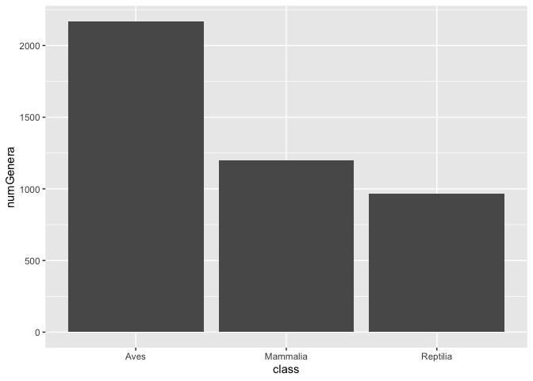
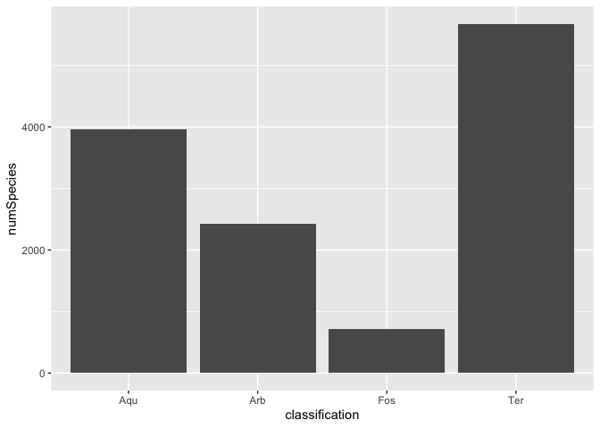
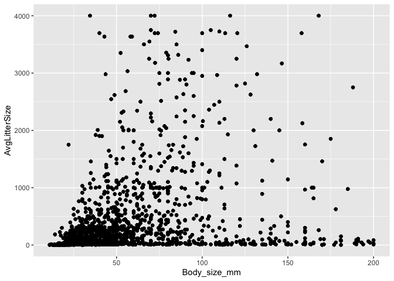

## Instructions
Answer the following questions and complete the exercises in RMarkdown. Please embed all of your code and push your final work to your repository. Your final lab report should be organized, clean, and run free from errors. Remember, you must remove the `#` for the included code chunks to run.  

## Libraries

```r
library(tidyverse)
```

```
## <U+2500><U+2500> Attaching packages <U+2500><U+2500><U+2500><U+2500><U+2500><U+2500><U+2500><U+2500><U+2500><U+2500><U+2500><U+2500><U+2500><U+2500><U+2500><U+2500><U+2500><U+2500><U+2500><U+2500><U+2500><U+2500><U+2500><U+2500><U+2500><U+2500><U+2500><U+2500><U+2500><U+2500><U+2500><U+2500><U+2500><U+2500><U+2500><U+2500><U+2500><U+2500><U+2500><U+2500><U+2500> tidyverse 1.3.0 <U+2500><U+2500>
```

```
## <U+2713> ggplot2 3.2.1     <U+2713> purrr   0.3.3
## <U+2713> tibble  2.1.3     <U+2713> dplyr   0.8.3
## <U+2713> tidyr   1.0.0     <U+2713> stringr 1.4.0
## <U+2713> readr   1.3.1     <U+2713> forcats 0.4.0
```

```
## <U+2500><U+2500> Conflicts <U+2500><U+2500><U+2500><U+2500><U+2500><U+2500><U+2500><U+2500><U+2500><U+2500><U+2500><U+2500><U+2500><U+2500><U+2500><U+2500><U+2500><U+2500><U+2500><U+2500><U+2500><U+2500><U+2500><U+2500><U+2500><U+2500><U+2500><U+2500><U+2500><U+2500><U+2500><U+2500><U+2500><U+2500><U+2500><U+2500><U+2500><U+2500><U+2500><U+2500><U+2500><U+2500><U+2500><U+2500> tidyverse_conflicts() <U+2500><U+2500>
## x dplyr::filter() masks stats::filter()
## x dplyr::lag()    masks stats::lag()
```

```r
library(naniar)
library(skimr)
```

```
## 
## Attaching package: 'skimr'
```

```
## The following object is masked from 'package:naniar':
## 
##     n_complete
```

## Data
For this homework, we will use two different data sets. Please load `amniota` and `amphibio`.  

### `amniota` data
Myhrvold N, Baldridge E, Chan B, Sivam D, Freeman DL, Ernest SKM (2015). “An amniote life-history
database to perform comparative analyses with birds, mammals, and reptiles.” _Ecology_, *96*, 3109.
doi: 10.1890/15-0846.1 (URL: https://doi.org/10.1890/15-0846.1).

```r
amniota <- 
  readr::read_csv("amniota.csv")
```

```
## Parsed with column specification:
## cols(
##   .default = col_double(),
##   class = col_character(),
##   order = col_character(),
##   family = col_character(),
##   genus = col_character(),
##   species = col_character(),
##   common_name = col_character()
## )
```

```
## See spec(...) for full column specifications.
```

### `amphibio` data
Oliveira BF, São-Pedro VA, Santos-Barrera G, Penone C, Costa GC (2017). “AmphiBIO, a global database
for amphibian ecological traits.” _Scientific Data_, *4*, 170123. doi: 10.1038/sdata.2017.123 (URL:
https://doi.org/10.1038/sdata.2017.123).

```r
amphibio <- 
  readr::read_csv("amphibio.csv")
```

```
## Parsed with column specification:
## cols(
##   .default = col_double(),
##   id = col_character(),
##   Order = col_character(),
##   Family = col_character(),
##   Genus = col_character(),
##   Species = col_character(),
##   Seeds = col_logical(),
##   OBS = col_logical()
## )
```

```
## See spec(...) for full column specifications.
```

```
## Warning: 125 parsing failures.
##  row col           expected                                                           actual           file
## 1410 OBS 1/0/T/F/TRUE/FALSE Identified as P. appendiculata in Boquimpani-Freitas et al. 2002 'amphibio.csv'
## 1416 OBS 1/0/T/F/TRUE/FALSE Identified as T. miliaris in Giaretta and Facure 2004            'amphibio.csv'
## 1447 OBS 1/0/T/F/TRUE/FALSE Considered endangered by Soto-Azat et al. 2013                   'amphibio.csv'
## 1448 OBS 1/0/T/F/TRUE/FALSE Considered extinct by Soto-Azat et al. 2013                      'amphibio.csv'
## 1471 OBS 1/0/T/F/TRUE/FALSE nomem dubitum                                                    'amphibio.csv'
## .... ... .................. ................................................................ ..............
## See problems(...) for more details.
```

## Questions  
**1. First, do some exploratory analysis of both data sets. What is the structure, column names, and dimensions?**  

```r
dim(amphibio)
```

```
## [1] 6776   38
```

```r
names(amphibio)
```

```
##  [1] "id"                      "Order"                  
##  [3] "Family"                  "Genus"                  
##  [5] "Species"                 "Fos"                    
##  [7] "Ter"                     "Aqu"                    
##  [9] "Arb"                     "Leaves"                 
## [11] "Flowers"                 "Seeds"                  
## [13] "Fruits"                  "Arthro"                 
## [15] "Vert"                    "Diu"                    
## [17] "Noc"                     "Crepu"                  
## [19] "Wet_warm"                "Wet_cold"               
## [21] "Dry_warm"                "Dry_cold"               
## [23] "Body_mass_g"             "Age_at_maturity_min_y"  
## [25] "Age_at_maturity_max_y"   "Body_size_mm"           
## [27] "Size_at_maturity_min_mm" "Size_at_maturity_max_mm"
## [29] "Longevity_max_y"         "Litter_size_min_n"      
## [31] "Litter_size_max_n"       "Reproductive_output_y"  
## [33] "Offspring_size_min_mm"   "Offspring_size_max_mm"  
## [35] "Dir"                     "Lar"                    
## [37] "Viv"                     "OBS"
```

```r
glimpse(amphibio)
```

```
## Observations: 6,776
## Variables: 38
## $ id                      <chr> "Anf0001", "Anf0002", "Anf0003", "Anf0004", "<U+2026>
## $ Order                   <chr> "Anura", "Anura", "Anura", "Anura", "Anura", <U+2026>
## $ Family                  <chr> "Allophrynidae", "Alytidae", "Alytidae", "Aly<U+2026>
## $ Genus                   <chr> "Allophryne", "Alytes", "Alytes", "Alytes", "<U+2026>
## $ Species                 <chr> "Allophryne ruthveni", "Alytes cisternasii", <U+2026>
## $ Fos                     <dbl> NA, NA, NA, NA, NA, 1, 1, 1, 1, 1, 1, 1, 1, N<U+2026>
## $ Ter                     <dbl> 1, 1, 1, 1, 1, 1, 1, 1, 1, 1, 1, 1, 1, 1, 1, <U+2026>
## $ Aqu                     <dbl> 1, 1, 1, 1, NA, 1, 1, 1, 1, 1, 1, 1, 1, 1, 1,<U+2026>
## $ Arb                     <dbl> 1, 1, 1, 1, 1, 1, NA, NA, NA, NA, NA, NA, NA,<U+2026>
## $ Leaves                  <dbl> NA, NA, NA, NA, NA, NA, NA, NA, NA, NA, NA, N<U+2026>
## $ Flowers                 <dbl> NA, NA, NA, NA, NA, NA, NA, NA, NA, NA, NA, N<U+2026>
## $ Seeds                   <lgl> NA, NA, NA, NA, NA, NA, NA, NA, NA, NA, NA, N<U+2026>
## $ Fruits                  <dbl> NA, NA, NA, NA, NA, NA, NA, NA, NA, NA, NA, N<U+2026>
## $ Arthro                  <dbl> 1, 1, 1, NA, 1, 1, 1, 1, 1, NA, 1, 1, NA, NA,<U+2026>
## $ Vert                    <dbl> NA, NA, NA, NA, NA, NA, 1, NA, NA, NA, 1, 1, <U+2026>
## $ Diu                     <dbl> 1, NA, NA, NA, NA, NA, 1, 1, 1, NA, 1, 1, NA,<U+2026>
## $ Noc                     <dbl> 1, 1, 1, NA, 1, 1, 1, 1, 1, NA, 1, 1, 1, NA, <U+2026>
## $ Crepu                   <dbl> 1, NA, NA, NA, NA, 1, NA, NA, NA, NA, NA, NA,<U+2026>
## $ Wet_warm                <dbl> NA, NA, NA, NA, 1, 1, NA, NA, NA, NA, 1, NA, <U+2026>
## $ Wet_cold                <dbl> 1, NA, NA, NA, NA, NA, 1, NA, NA, NA, NA, NA,<U+2026>
## $ Dry_warm                <dbl> NA, NA, NA, NA, NA, NA, NA, NA, NA, NA, NA, N<U+2026>
## $ Dry_cold                <dbl> NA, NA, NA, NA, NA, NA, NA, NA, NA, NA, NA, N<U+2026>
## $ Body_mass_g             <dbl> 31.00, 6.10, NA, NA, 2.31, 13.40, 21.80, NA, <U+2026>
## $ Age_at_maturity_min_y   <dbl> NA, 2.0, 2.0, NA, 3.0, 2.0, 3.0, NA, NA, NA, <U+2026>
## $ Age_at_maturity_max_y   <dbl> NA, 2.0, 2.0, NA, 3.0, 3.0, 5.0, NA, NA, NA, <U+2026>
## $ Body_size_mm            <dbl> 31.0, 50.0, 55.0, NA, 40.0, 55.0, 80.0, 60.0,<U+2026>
## $ Size_at_maturity_min_mm <dbl> NA, 27, NA, NA, NA, 35, NA, NA, NA, NA, NA, N<U+2026>
## $ Size_at_maturity_max_mm <dbl> NA, 36.0, NA, NA, NA, 40.5, NA, NA, NA, NA, N<U+2026>
## $ Longevity_max_y         <dbl> NA, 6, NA, NA, NA, 7, 9, NA, NA, NA, NA, NA, <U+2026>
## $ Litter_size_min_n       <dbl> 300, 60, 40, NA, 7, 53, 300, 1500, 1000, NA, <U+2026>
## $ Litter_size_max_n       <dbl> 300, 180, 40, NA, 20, 171, 1500, 1500, 1000, <U+2026>
## $ Reproductive_output_y   <dbl> 1, 4, 1, 4, 1, 4, 6, 1, 1, 1, 1, 1, 1, 1, NA,<U+2026>
## $ Offspring_size_min_mm   <dbl> NA, 2.6, NA, NA, 5.4, 2.6, 1.5, NA, 1.5, NA, <U+2026>
## $ Offspring_size_max_mm   <dbl> NA, 3.5, NA, NA, 7.0, 5.0, 2.0, NA, 1.5, NA, <U+2026>
## $ Dir                     <dbl> 0, 0, 0, 0, 0, 0, 0, 0, 0, 0, 0, 0, 0, 0, 0, <U+2026>
## $ Lar                     <dbl> 1, 1, 1, 1, 1, 1, 1, 1, 1, 1, 1, 1, 1, 1, 1, <U+2026>
## $ Viv                     <dbl> 0, 0, 0, 0, 0, 0, 0, 0, 0, 0, 0, 0, 0, 0, 0, <U+2026>
## $ OBS                     <lgl> NA, NA, NA, NA, NA, NA, NA, NA, NA, NA, NA, N<U+2026>
```

```r
dim(amniota)
```

```
## [1] 21322    36
```

```r
names(amniota)
```

```
##  [1] "class"                                
##  [2] "order"                                
##  [3] "family"                               
##  [4] "genus"                                
##  [5] "species"                              
##  [6] "subspecies"                           
##  [7] "common_name"                          
##  [8] "female_maturity_d"                    
##  [9] "litter_or_clutch_size_n"              
## [10] "litters_or_clutches_per_y"            
## [11] "adult_body_mass_g"                    
## [12] "maximum_longevity_y"                  
## [13] "gestation_d"                          
## [14] "weaning_d"                            
## [15] "birth_or_hatching_weight_g"           
## [16] "weaning_weight_g"                     
## [17] "egg_mass_g"                           
## [18] "incubation_d"                         
## [19] "fledging_age_d"                       
## [20] "longevity_y"                          
## [21] "male_maturity_d"                      
## [22] "inter_litter_or_interbirth_interval_y"
## [23] "female_body_mass_g"                   
## [24] "male_body_mass_g"                     
## [25] "no_sex_body_mass_g"                   
## [26] "egg_width_mm"                         
## [27] "egg_length_mm"                        
## [28] "fledging_mass_g"                      
## [29] "adult_svl_cm"                         
## [30] "male_svl_cm"                          
## [31] "female_svl_cm"                        
## [32] "birth_or_hatching_svl_cm"             
## [33] "female_svl_at_maturity_cm"            
## [34] "female_body_mass_at_maturity_g"       
## [35] "no_sex_svl_cm"                        
## [36] "no_sex_maturity_d"
```

```r
glimpse(amniota)
```

```
## Observations: 21,322
## Variables: 36
## $ class                                 <chr> "Aves", "Aves", "Aves", "Aves",<U+2026>
## $ order                                 <chr> "Accipitriformes", "Accipitrifo<U+2026>
## $ family                                <chr> "Accipitridae", "Accipitridae",<U+2026>
## $ genus                                 <chr> "Accipiter", "Accipiter", "Acci<U+2026>
## $ species                               <chr> "albogularis", "badius", "bicol<U+2026>
## $ subspecies                            <dbl> -999, -999, -999, -999, -999, -<U+2026>
## $ common_name                           <chr> "Pied Goshawk", "Shikra", "Bico<U+2026>
## $ female_maturity_d                     <dbl> -999.000, 363.468, -999.000, -9<U+2026>
## $ litter_or_clutch_size_n               <dbl> -999.000, 3.250, 2.700, -999.00<U+2026>
## $ litters_or_clutches_per_y             <dbl> -999, 1, -999, -999, 1, -999, -<U+2026>
## $ adult_body_mass_g                     <dbl> 251.500, 140.000, 345.000, 142.<U+2026>
## $ maximum_longevity_y                   <dbl> -999.00000, -999.00000, -999.00<U+2026>
## $ gestation_d                           <dbl> -999, -999, -999, -999, -999, -<U+2026>
## $ weaning_d                             <dbl> -999, -999, -999, -999, -999, -<U+2026>
## $ birth_or_hatching_weight_g            <dbl> -999, -999, -999, -999, -999, -<U+2026>
## $ weaning_weight_g                      <dbl> -999, -999, -999, -999, -999, -<U+2026>
## $ egg_mass_g                            <dbl> -999.00, 21.00, 32.00, -999.00,<U+2026>
## $ incubation_d                          <dbl> -999.00, 30.00, -999.00, -999.0<U+2026>
## $ fledging_age_d                        <dbl> -999.00, 32.00, -999.00, -999.0<U+2026>
## $ longevity_y                           <dbl> -999.00000, -999.00000, -999.00<U+2026>
## $ male_maturity_d                       <dbl> -999, -999, -999, -999, -999, -<U+2026>
## $ inter_litter_or_interbirth_interval_y <dbl> -999, -999, -999, -999, -999, -<U+2026>
## $ female_body_mass_g                    <dbl> 352.500, 168.500, 390.000, -999<U+2026>
## $ male_body_mass_g                      <dbl> 223.000, 125.000, 212.000, 142.<U+2026>
## $ no_sex_body_mass_g                    <dbl> -999.0, 123.0, -999.0, -999.0, <U+2026>
## $ egg_width_mm                          <dbl> -999, -999, -999, -999, -999, -<U+2026>
## $ egg_length_mm                         <dbl> -999, -999, -999, -999, -999, -<U+2026>
## $ fledging_mass_g                       <dbl> -999, -999, -999, -999, -999, -<U+2026>
## $ adult_svl_cm                          <dbl> -999.00, 30.00, 39.50, -999.00,<U+2026>
## $ male_svl_cm                           <dbl> -999, -999, -999, -999, -999, -<U+2026>
## $ female_svl_cm                         <dbl> -999, -999, -999, -999, -999, -<U+2026>
## $ birth_or_hatching_svl_cm              <dbl> -999, -999, -999, -999, -999, -<U+2026>
## $ female_svl_at_maturity_cm             <dbl> -999, -999, -999, -999, -999, -<U+2026>
## $ female_body_mass_at_maturity_g        <dbl> -999, -999, -999, -999, -999, -<U+2026>
## $ no_sex_svl_cm                         <dbl> -999, -999, -999, -999, -999, -<U+2026>
## $ no_sex_maturity_d                     <dbl> -999, -999, -999, -999, -999, -<U+2026>
```

**2. How many total NAs are in each data set? Do these values make sense? Are NAs represented by any other values?**   

```r
amniota %>% 
   summarize(number_nas_amniota = sum(is.na(amniota))) 
```

```
## # A tibble: 1 x 1
##   number_nas_amniota
##                <int>
## 1                  0
```

```r
##These values definetly do not make sense. -999 probably represents a NA value
amphibio %>% 
  summarize(number_nas_amphibio = sum(is.na(amphibio)))
```

```
## # A tibble: 1 x 1
##   number_nas_amphibio
##                 <int>
## 1              170691
```

```r
##A lot of things do not make sense. For example, why is there a column for OBS if every single row is NA. I'm not sure if the 1's are supposed to be NAs, but since they're in columns with NAs, I think it is safe to assume it is a real value. 
```

**3. Make any necessary replacements in the data such that all NAs appear as "NA".**   

```r
amniotaTheSequel <- 
  amniota %>% 
  na_if("-999")
amniotaTheSequel%>% 
   summarize(number_nas_amniota = sum(is.na(amniotaTheSequel))) 
```

```
## # A tibble: 1 x 1
##   number_nas_amniota
##                <int>
## 1             528196
```


**4. Use the package `naniar` to produce a summary, including percentages, of missing data in each column for both data sets.**  

```r
naniar::miss_var_summary(amniotaTheSequel)
```

```
## # A tibble: 36 x 3
##    variable                       n_miss pct_miss
##    <chr>                           <int>    <dbl>
##  1 subspecies                      21322    100  
##  2 female_body_mass_at_maturity_g  21318    100. 
##  3 female_svl_at_maturity_cm       21120     99.1
##  4 fledging_mass_g                 21111     99.0
##  5 male_svl_cm                     21040     98.7
##  6 no_sex_maturity_d               20860     97.8
##  7 egg_width_mm                    20727     97.2
##  8 egg_length_mm                   20702     97.1
##  9 weaning_weight_g                20258     95.0
## 10 female_svl_cm                   20242     94.9
## # <U+2026> with 26 more rows
```

```r
naniar::miss_var_summary(amphibio)
```

```
## # A tibble: 38 x 3
##    variable n_miss pct_miss
##    <chr>     <int>    <dbl>
##  1 OBS        6776    100  
##  2 Fruits     6774    100. 
##  3 Flowers    6772     99.9
##  4 Seeds      6772     99.9
##  5 Leaves     6752     99.6
##  6 Dry_cold   6735     99.4
##  7 Vert       6657     98.2
##  8 Wet_cold   6625     97.8
##  9 Crepu      6608     97.5
## 10 Dry_warm   6572     97.0
## # <U+2026> with 28 more rows
```


**5. For the `amniota` data, calculate the number of NAs in the `egg_mass_g` column sorted by taxonomic class; i.e. how many NAs are present in the `egg_mass_g` column in birds, mammals, and reptiles? Does this results make sense biologically? How do these results affect your interpretation of NAs?**  

```r
amniotaTheSequel %>%
  group_by(class) %>%
  select(class, egg_mass_g) %>% 
  naniar::miss_var_summary(class=T)
```

```
## Warning: `cols` is now required.
## Please use `cols = c(data)`
```

```
## # A tibble: 3 x 4
## # Groups:   class [3]
##   class    variable   n_miss pct_miss
##   <chr>    <chr>       <int>    <dbl>
## 1 Aves     egg_mass_g   4914     50.1
## 2 Mammalia egg_mass_g   4953    100  
## 3 Reptilia egg_mass_g   6040     92.0
```

```r
##All of the recorded mammals are missing eggs, because most mammals don't lay eggs. Most of the reptilia egg mass data is missing and half of the bird data is missing, which makes me think that the data was simply not gathered.
```


**6. Which taxonomic classes are represented in the data? Summarize this in a chart then make a barplot that shows the proportion of observations in each taxonomic class.**

```r
amniotaTheSequel %>% 
  group_by(class)%>%
  summarize(numObs = n())
```

```
## # A tibble: 3 x 2
##   class    numObs
##   <chr>     <int>
## 1 Aves       9802
## 2 Mammalia   4953
## 3 Reptilia   6567
```

```r
ggplot(data = amniotaTheSequel, mapping = aes(x = class,)) +
  geom_bar(stat = "count")
```

<!-- -->


**7. Let's explore the taxonomic composition of the data a bit more. How many genera are represented by taxonomic class? Present this as a data table and bar plot.**

```r
amniotaTheSequel %>% 
  group_by(class) %>% 
  summarize(numGenera = n_distinct(genus))
```

```
## # A tibble: 3 x 2
##   class    numGenera
##   <chr>        <int>
## 1 Aves          2169
## 2 Mammalia      1200
## 3 Reptilia       967
```

```r
amniotaTheSequel %>% 
  group_by(class) %>% 
  summarize(numGenera = n_distinct(genus)) %>% 
  ggplot(aes(x = class, y = numGenera)) +
  geom_bar(stat = "identity")
```

<!-- -->


**8. Lastly, how many species are represented in each taxonomic class? Present this as a data table and bar plot.**

```r
amniotaTheSequel %>% 
  group_by(class) %>% 
  summarize(numSpecies = n_distinct(species))
```

```
## # A tibble: 3 x 2
##   class    numSpecies
##   <chr>         <int>
## 1 Aves           5525
## 2 Mammalia       3473
## 3 Reptilia       4692
```

```r
amniotaTheSequel %>% 
  group_by(class) %>% 
  summarize(numSpecies = n_distinct(species)) %>% 
  ggplot(aes(x = class, y = numSpecies)) +
  geom_bar(stat = "identity")
```

<!-- -->

**9. The `amphibio` data includes information on ecology. Each species is classified as fossorial, terrestrial, aquatic, or arboreal. How many species are in each of these categories? Make a bar plot to visualize these results. Which category is most/ least represented in the data?**

```r
amphibio %>% 
  pivot_longer(Fos:Arb, 
               names_to = "classification",
               values_to = "count") %>% 
  group_by(classification) %>% 
  summarize(numSpecies = sum(count, na.rm = T)) %>% 
  ggplot(aes(x = classification, y = numSpecies)) +
  geom_bar(stat = "identity")
```

<!-- -->


**10. For the amphibio data, we are interested to know if body size is correlated with litter size? Make a plot that shows this relationship. You should notice that there are outliers. Can you think of a way to identify the outliers for both body size and litter size? What happens when you then re-plot the data?**

```r
amp<-amphibio %>%
  pivot_longer(Fos:Arb, 
               names_to = "classification",
               values_to = "count") %>% 
  rowwise() %>% mutate(AvgLitterSize=mean(c(Litter_size_max_n, Litter_size_min_n), na.rm=T))
  ggplot(data = amp, mapping = aes(x = Body_size_mm, y = AvgLitterSize))+
  geom_point()
```

```
## Warning: Removed 20724 rows containing missing values (geom_point).
```

<!-- -->

```r
sd(amp$AvgLitterSize, na.rm = T)
```

```
## [1] 2106.547
```

```r
sd(amp$Body_size_mm,na.rm = T)
```

```
## [1] 91.45911
```

```r
amp %>%
  filter(Body_size_mm <=200 & AvgLitterSize<=4000) %>% 
  ggplot(aes(x=Body_size_mm, AvgLitterSize)) +
  geom_point()
```

<!-- -->


## Push your final code to GitHub!
Please be sure that you check the `keep md` file in the knit preferences. 
